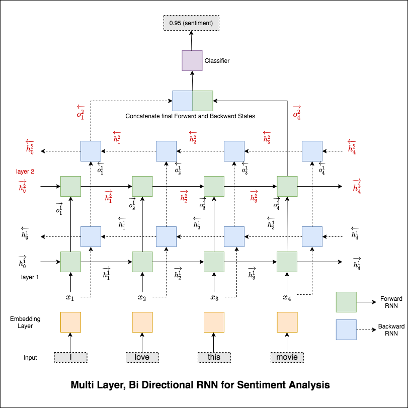

<h1 align="center" style="font-size:80px">
    Classification based Applications in NLP
</h1>

There are many classification based problems in NLP like document classification, intent classification, question classification, sentiment analysis, emotion prediction and many others. Here I will be exploring a few of the applications.

**Note: Please raise an issue for any suggestions, corrections, and feedback.**

# Sentiment Analysis

Sentiment analysis refers to the use of natural language processing, text analysis, computational linguistics, and biometrics to systematically identify, extract, quantify, and study affective states and subjective information.

## IMDB - Dataset of 50K Movie Reviews

This is a dataset for binary sentiment classification containing a set of 25,000 highly polar movie reviews for training and 25,000 for testing. 

### Simple Sentiment Analysis.ipynb

This notebook covers the basic workflow. We'll learn how to: load data, create train/test/validation splits, build a vocabulary, create data iterators, define a model and implement the train/evaluate/test loop.

The model used is a simple RNN network

Since the model is simple, performance will be poor. But this will be improved in the subsequent experiments.

#### Resources

- [IMDB dataset](http://ai.stanford.edu/~amaas/data/sentiment/)
- [Ben Trevett Sentiment analysis](https://github.com/bentrevett/pytorch-sentiment-analysis)
- [My notebook on RNN](https://github.com/graviraja/100-Days-of-NLP/blob/master/architectures/RNN.ipynb)

### Improved Sentiment Analysis.ipynb

After trying the basic RNN which gives a test_accuracy less than 50%, following techniques have been experimented and a test_accuracy above 88% is achieved.

The model used is a Multi Layer Bidirectional LSTM network

#### Resources

- [Packed Padded Sequences](https://github.com/graviraja/pytorch-sample-codes/blob/master/pad_sequences.py)
- [Embeddings](https://github.com/graviraja/100-Days-of-NLP/tree/master/embeddings)
- [Multi Layer RNN](https://github.com/graviraja/100-Days-of-NLP/blob/master/architectures/RNN.ipynb)
- [Dropout - Andrew NG tutorial](https://www.youtube.com/watch?v=ARq74QuavAo)
- [Ben Trevett Notebook](https://github.com/bentrevett/pytorch-sentiment-analysis/blob/master/2%20-%20Upgraded%20Sentiment%20Analysis.ipynb)

### Sentiment Analysis with Attention.ipynb

Attention helps in focusing on the relevant input when predicting the sentiment of the input. Bahdanau attention was used with taking the outputs of LSTM and concatenating the final forward & backward hidden state. Without using the pre-trained word embeddings, test accuracy of `88%` is achieved.

The architecture looks like this:

Attention can also be visualized

#### Resources

- [Bahdananu Attention](https://github.com/graviraja/100-Days-of-NLP/blob/applications/sentiment/architectures/bahdanau_attention.py)

# Document Classification

## Document Classification with Hierarchical Attention Network

A Hierarchical Attention Network (HAN) considers the hierarchical structure of documents (document - sentences - words) and includes an attention mechanism that is able to find the most important words and sentences in a document while taking the context into consideration.

Summarizing, HAN tries to find a solution for these problems that previous works did not consider:

Not every word in a sentence and every sentence in a document are equally important to understand the main message of a document.

The changing meaning of a word depending on the context needs to be taken into consideration. For example, the meaning of the word “pretty” can change depending on the way it is used: “The bouquet of flowers is pretty” vs. “The food is pretty bad”.

In this way, HAN performs better in predicting the class of a given document.

### Resources

- [Humboldt Univeristy Blog](https://humboldt-wi.github.io/blog/research/information_systems_1819/group5_han/)
- [Blog on using HAN to classification](https://towardsdatascience.com/predicting-amazon-reviews-scores-using-hierarchical-attention-networks-with-pytorch-and-apache-5214edb3df20)
- [Amazon Review Data](http://jmcauley.ucsd.edu/data/amazon/)
- [Image referece](https://medium.com/analytics-vidhya/hierarchical-attention-networks-d220318cf87e)