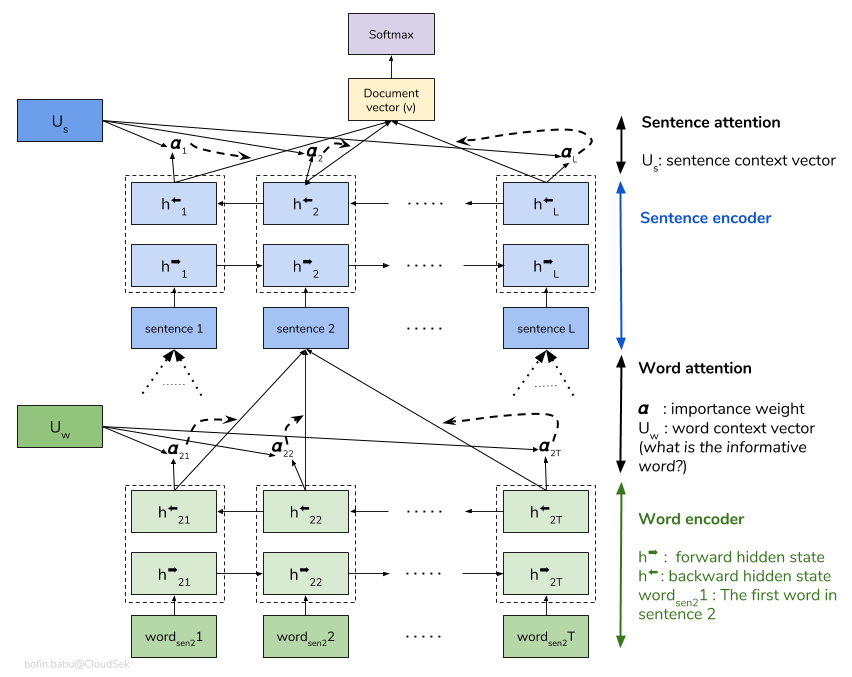

# Document Classification with Hierarchical Attention Network

A Hierarchical Attention Network (HAN) considers the hierarchical structure of documents (document - sentences - words) and includes an attention mechanism that is able to find the most important words and sentences in a document while taking the context into consideration.

Summarizing, HAN tries to find a solution for these problems that previous works did not consider:

Not every word in a sentence and every sentence in a document are equally important to understand the main message of a document.

The changing meaning of a word depending on the context needs to be taken into consideration. For example, the meaning of the word “pretty” can change depending on the way it is used: “The bouquet of flowers is pretty” vs. “The food is pretty bad”.

In this way, HAN performs better in predicting the class of a given document.

### Resources

- [Humboldt Univeristy Blog](https://humboldt-wi.github.io/blog/research/information_systems_1819/group5_han/)
- [Blog on using HAN to classification](https://towardsdatascience.com/predicting-amazon-reviews-scores-using-hierarchical-attention-networks-with-pytorch-and-apache-5214edb3df20)
- [HAN paper](https://www.cs.cmu.edu/~./hovy/papers/16HLT-hierarchical-attention-networks.pdf)
- [LSTM Regularization paper](https://arxiv.org/pdf/1708.02182.pdf)
- [Amazon Review Data](http://jmcauley.ucsd.edu/data/amazon/)
- [Image referece](https://medium.com/analytics-vidhya/hierarchical-attention-networks-d220318cf87e)
