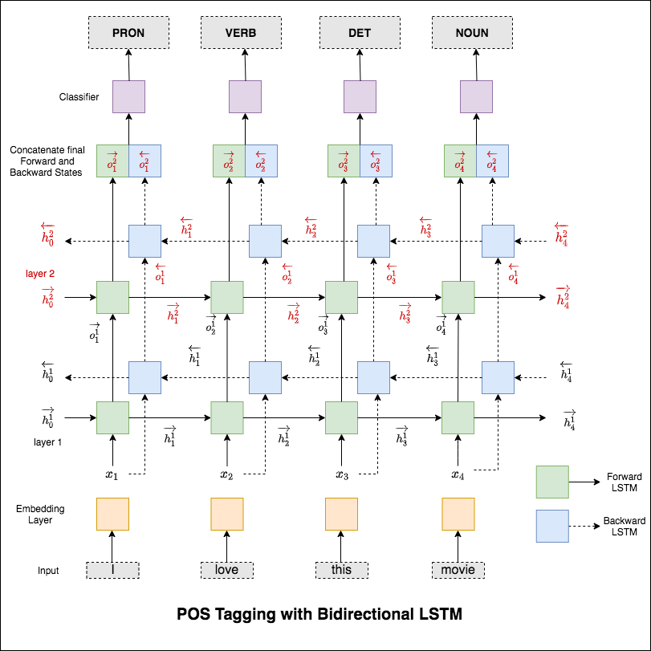
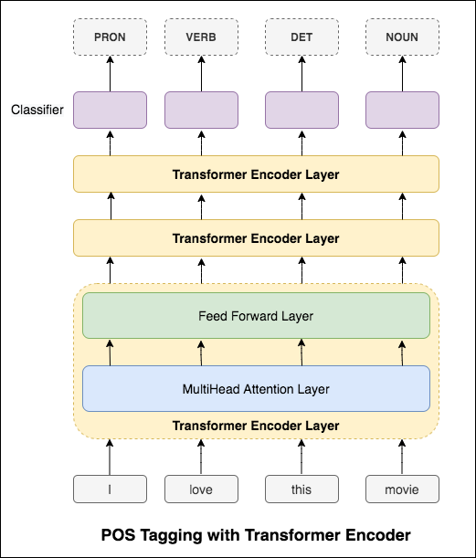

# POS Tagging

Part-of-Speech (PoS) tagging, is a task of labelling each word in a sentence with its appropriate part of speech.

## POS tagging with BiLSTM.py

This code covers the basic workflow. We'll learn how to: load data, create train/test/validation splits, build a vocabulary, create data iterators, define a model and implement the train/evaluate/test loop and run time (inference) tagging.

The model used is a Multi Layer Bi-directional LSTM network

A test accuracy of `88%` is achieved without the use of pre-trained embeddings. With that it might improve more.

#### Resources

- [LSTM](https://github.com/graviraja/100-Days-of-NLP/blob/master/architectures/RNN.ipynb)
- [POS tagging](https://github.com/bentrevett/pytorch-pos-tagging/)
- [UDPOS dataset](https://pytorch.org/text/datasets.html#udpos)

## POS tagging with Transformer.py

After trying the RNN approach, POS tagging with Transformer based architecture is explored. Since the Transformer contains both Encoder and Decoder and for the sequence labeling task only `Encoder` will be sufficient. As the data is small having 6 layers of Encoder will overfit the data. So a 3-layer Transformer Encoder model was used.

#### Resources

- [Transformer - Pytorch docs](https://pytorch.org/docs/stable/nn.html#transformer)
- [Transformer - My Sample code](https://github.com/graviraja/100-Days-of-NLP/blob/master/architectures/transformer.py)

## POS tagging with BERT.ipynb

After trying POS tagging with Transformer Encoder, POS Tagging with pre-trained BERT model is exploed. It achieved test accuracy of `91%`.

#### Resources

- [PoS tagging - Ben Trevett](https://github.com/bentrevett/pytorch-pos-tagging/)
