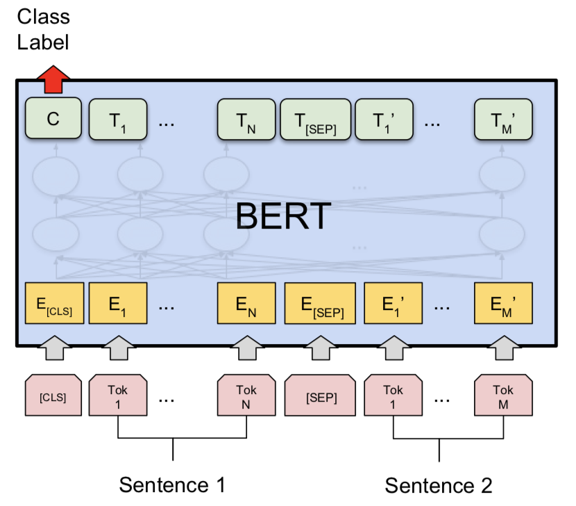

# QQP Classification with Siamese.ipynb

QQP stands for Quora Question Pairs. The objective of the task is for a given pair of questions; we need to find whether those questions are semantically similar to each other or not.

Quora released a dataset containing 400,000 pairs of potential question duplicate pairs. Each row contains IDs for each question in the pair, the full text for each question, and a binary value that indicates whether the line truly contains a duplicate pair.

The algorithm needs to take the pair of questions as input and should output their similarity. A Siamese network is used. A `Siamese neural network` (sometimes called a twin neural network) is an artificial neural network that uses the `same weights` while working in tandem on two different input vectors to compute comparable output vectors.

There are many potential use-cases upon solving this problem. Few of them are: 
- Detecting a similar questions in social media platforms like Quora, Stackoverflow, Stackexchange, etc
- As a classifier in GAN's for generating paraphrases
- Chatbots

# QQP Classification with BERT.ipynb

After trying the siamese model, BERT was explored to do the Quora duplicate question pairs detection. BERT takes the question 1 and question 2 as input separated by `[SEP]` token and the classification was done using the final representation of `[CLS]` token.

### References

- [Hugging-face-nlp-demo code](https://github.com/yk/huggingface-nlp-demo/blob/master/demo.py)
- [Hugging-face-nlp-demo video tutorial](https://www.youtube.com/watch?v=G3pOvrKkFuk&feature=youtu.be)