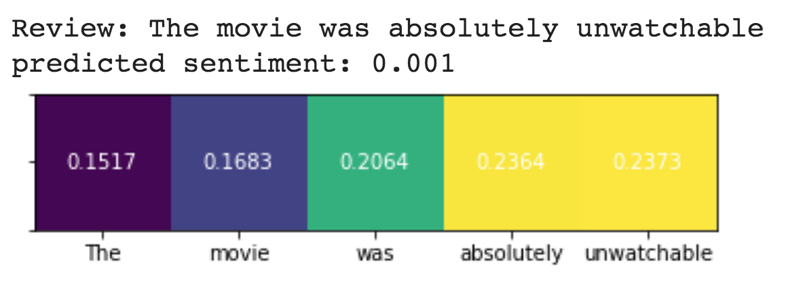
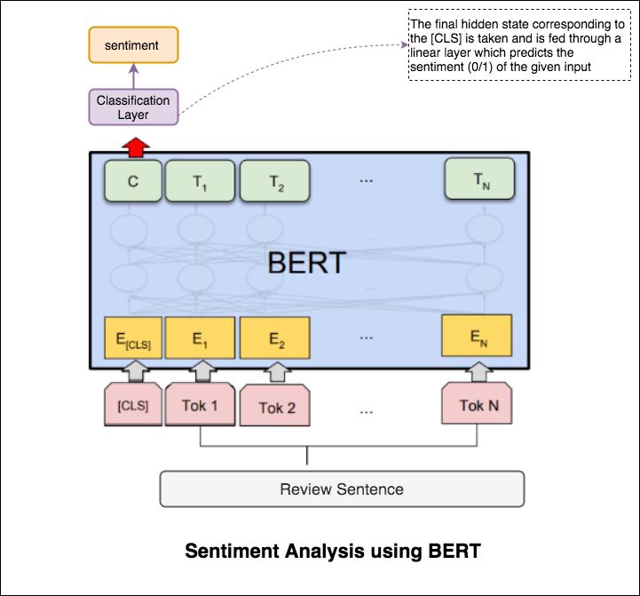

# Sentiment Analysis

Sentiment analysis refers to the use of natural language processing, text analysis, computational linguistics, and biometrics to systematically identify, extract, quantify, and study affective states and subjective information.

## IMDB - Dataset of 50K Movie Reviews

This is a dataset for binary sentiment classification containing a set of 25,000 highly polar movie reviews for training and 25,000 for testing. 

### Simple Sentiment Analysis.ipynb

This notebook covers the basic workflow. We'll learn how to: load data, create train/test/validation splits, build a vocabulary, create data iterators, define a model and implement the train/evaluate/test loop.

The model used is a simple RNN network

Since the model is simple, performance will be poor. But this will be improved in the subsequent experiments.

#### Resources

- [IMDB dataset](http://ai.stanford.edu/~amaas/data/sentiment/)
- [Ben Trevett Sentiment analysis](https://github.com/bentrevett/pytorch-sentiment-analysis)
- [My notebook on RNN](https://github.com/graviraja/100-Days-of-NLP/blob/master/architectures/RNN.ipynb)

### Improved Sentiment Analysis.ipynb

After trying the basic RNN which gives a test_accuracy less than 50%, following techniques have been experimented and a test_accuracy above 88% is achieved.

The model used is a Multi Layer Bidirectional LSTM network

#### Resources

- [Packed Padded Sequences](https://github.com/graviraja/pytorch-sample-codes/blob/master/pad_sequences.py)
- [Embeddings](https://github.com/graviraja/100-Days-of-NLP/tree/master/embeddings)
- [Multi Layer RNN](https://github.com/graviraja/100-Days-of-NLP/blob/master/architectures/RNN.ipynb)
- [Dropout - Andrew NG tutorial](https://www.youtube.com/watch?v=ARq74QuavAo)
- [Ben Trevett Notebook](https://github.com/bentrevett/pytorch-sentiment-analysis/blob/master/2%20-%20Upgraded%20Sentiment%20Analysis.ipynb)

### Sentiment Analysis with Attention.ipynb

Attention helps in focusing on the relevant input when predicting the sentiment of the input. Bahdanau attention was used with taking the outputs of LSTM and concatenating the final forward & backward hidden state. Without using the pre-trained word embeddings, test accuracy of `88%` is achieved.

The architecture looks like this:

Attention can also be visualized

#### Resources

- [Bahdananu Attention](https://github.com/graviraja/100-Days-of-NLP/blob/applications/sentiment/architectures/bahdanau_attention.py)

### Sentiment Analysis with BERT.ipynb

BERT obtains new state-of-the-art results on eleven natural language processing tasks. Transfer learning in NLP has triggered after the release of BERT model. In this notebook, we will explore how to use BERT for Sentiment Analysis.

Sentiment analysis using BERT can be summarized as:
- Tokenize the sentence using BERT tokenizer (word-piece)
- Add the specical tokens used in BERT
- Send the tokenized sentence through BERT layers
- Take the final hidden state of the `[CLS]` token
- Send this hidden state to through a simple linear classifier which predicts the sentiment

*Note: The amount of time taken by BERT model to train the IMDB dataset is huge compared to the previous implementations. GPU is required to train the model*
