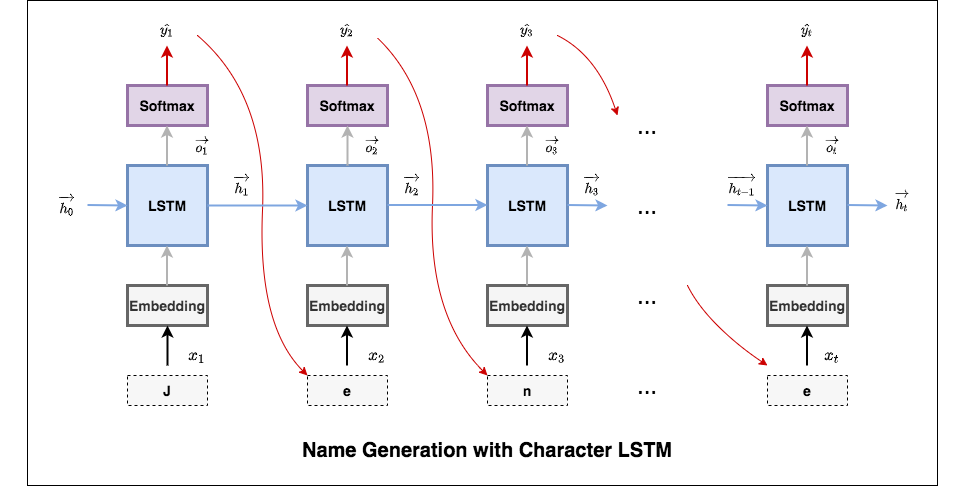

<h1 align="center" style="font-size:80px">
    Generation based Applications in NLP
</h1>

There are many generation based problems in NLP like language modelling, machine translation, text summarization, sequence to sequence problems like NER, POS tagging, Image Captioning, and many others. Here I will be exploring a few of the applications.

**Note: Please raise an issue for any suggestions, corrections, and feedback.**

# Language Modelling

What is a Language Model in NLP? Language modeling is central to many important natural language processing tasks. A language model learns to predict the probability of a sequence of words.

## Generating Names.ipynb

Given a starting character, generate a name starting with that character. 

We’ll train LSTM character-level language models. That is, we’ll give the LSTM a huge chunk of names and ask it to model the probability distribution of the next character in the sequence given a sequence of previous characters. This will then allow us to generate new name one character at a time.

As a working example, suppose we only had a vocabulary of all alphabets in English, and wanted to train an RNN on the training sequence "Jennie". This training sequence is in fact a source of 5 separate training examples: 
1. The probability of `e` should be likely given the context of `J`, 
2. `n` should be likely in the context of `Je`, 
3. `n` should also be likely given the context of `Jen`,
4. `i` should also be likely given the context of `Jenn`, 
and finally 
5. `e` should be likely given the context of `Jenni`.

#### Resources

- [Unreasonable effectiveness of RNN](http://karpathy.github.io/2015/05/21/rnn-effectiveness/)
- [US Baby Names Dataset](https://www.kaggle.com/kaggle/us-baby-names?select=NationalNames.csv)
- [Language Modelling - ChunML](https://github.com/ChunML/NLP/blob/master/text_generation/)
