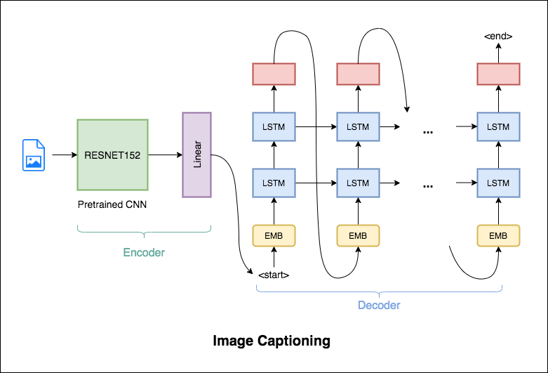

# Image Captioning

Image Captioning is the process of generating a textual description of an image. It uses both Natural Language Processing and Computer Vision techniques to generate the captions.

The encoder-decoder framework is widely used for this task. The image encoder is a convolutional neural network (CNN). The decoder is a recurrent neural network(RNN) which takes in the encoded image and generates the caption.

## Basic Image Captioning.ipynb

In this notebook, the resnet-152 model pretrained on the ILSVRC-2012-CLS image classification dataset is used as the encoder. The decoder is a long short-term memory (LSTM) network.

Flickr8K dataset is used. It contains 8092 images, each image having 5 captions.

#### Resources

- [Flickr8k Dataset](https://www.kaggle.com/adityajn105/flickr8k?rvi=1)
- [Reference code](https://github.com/yunjey/pytorch-tutorial/tree/master/tutorials/03-advanced/image_captioning)