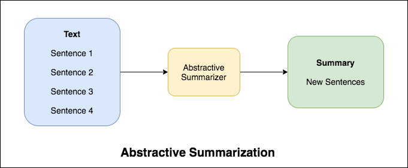

# Text Summarization

Automatic text summarization is the task of producing a concise and fluent summary while preserving key information content and overall meaning

There are broadly two different approaches that are used for text summarization:

- Extractive Summarization
- Abstractive Summarization

**`Extractive Summarization`**: We identify the important sentences or phrases from the original text and extract only those from the text. Those extracted sentences would be our summary. The below diagram illustrates extractive summarization:

**`Abstractive Summarization`**: Here, we generate new sentences from the original text. This is in contrast to the extractive approach we saw earlier where we used only the sentences that were present. The sentences generated through abstractive summarization might not be present in the original text. The below diagram illustrates abstractive summarization:

The Encoder-Decoder architecture is mainly used to solve the sequence-to-sequence (Seq2Seq) problems (summarization) where the input and output sequences are of different lengths.

## News Summarization with T5.ipynb

Have you come across the mobile app `inshorts`? It’s an innovative news app that converts news articles into a 60-word summary.  And that is exactly what we are going to do in this notebook.

The model used for this task is `T5`.

T5 reframes all NLP tasks into a unified text-to-text-format where the input and output are always text strings, in contrast to BERT-style models that can only output either a class label or a span of the input. The text-to-text framework allows us to use the same model, loss function, and hyperparameters on any NLP task, including machine translation, document summarization, question answering, and classification tasks (e.g., sentiment analysis). We can even apply T5 to regression tasks by training it to predict the string representation of a number instead of the number itself.

For the article on [twitter accounts hacked](https://www.indiatoday.in/technology/news/story/twitter-accounts-hacked-hackers-explain-how-they-got-access-to-accounts-of-bill-gates-others-1701138-2020-07-16), our model summarized the news as below:

> a Twitter employee was apparently the reason behind the hacking of high profile accounts that took place on Wednesday night. The hacker then used an internal tool to take over the accounts, according to a report in the New York Times.The account was also used to post tweets related to cryptocurrency scams from the high profile accounts that were hacked by the hacker, who claimed to have been paid by the company?s insiders.Also read: #BitcoinScamTomorrow

#### Resources

- [News Dataset](https://www.kaggle.com/sunnysai12345/news-summary)
- [Google AI blog on T5](https://ai.googleblog.com/2020/02/exploring-transfer-learning-with-t5.html)
- [Youtube video explaination by one of the author itself - Colin Raffel](https://www.youtube.com/watch?v=eKqWC577WlI)
- [Video explaining T5 - Henry AI Labs](https://www.youtube.com/watch?v=Axo0EtMUK90&t=208s)
- [Medium blog on key observations of the paper](https://towardsdatascience.com/t5-a-model-that-explores-the-limits-of-transfer-learning-fb29844890b7)
- [T5 paper](https://arxiv.org/pdf/1910.10683.pdf)
- [Huggingface T5 model documentation](https://huggingface.co/transformers/model_doc/t5.html)
- [Reference code](https://github.com/abhimishra91/transformers-tutorials/blob/master/transformers_summarization_wandb.ipynb)