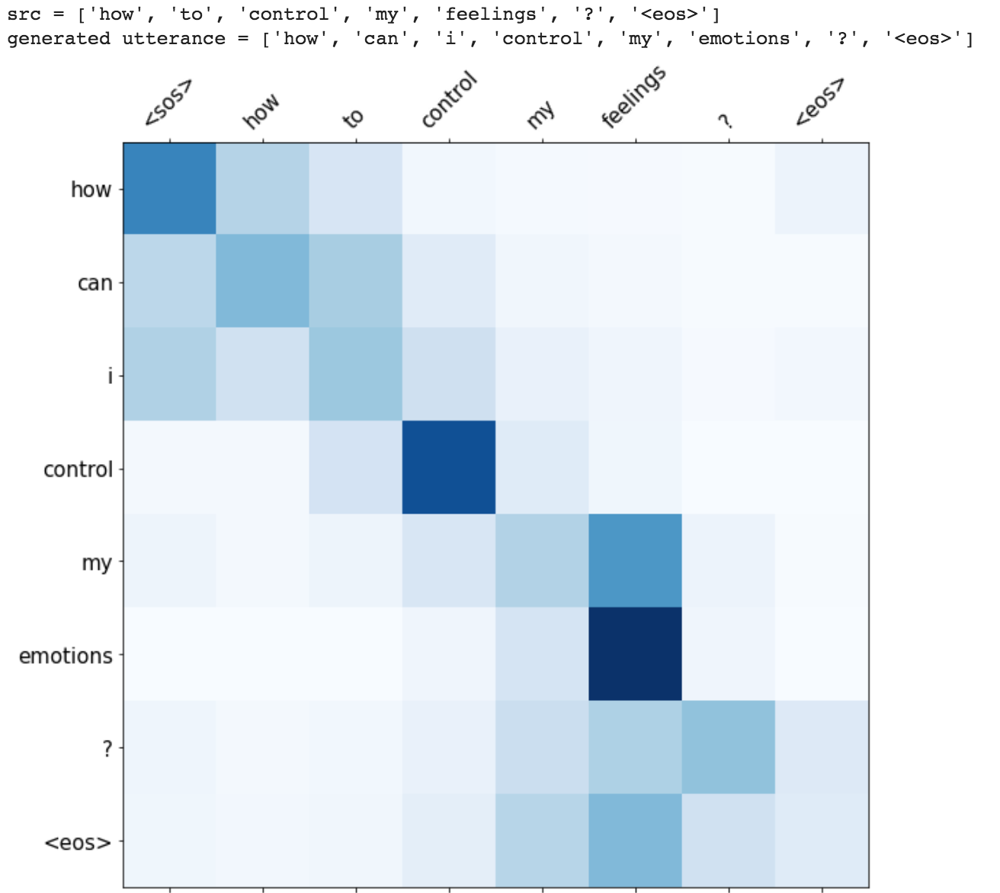

# Utterance Generation

Utterance generation is an important problem in NLP, especially in question answering, information retrieval, information extraction, conversation systems, to name a few. It could also be used to create synthentic training data for many NLP problems.

## Basic Utterance Generation.ipynb

The most common sequence-to-sequence (seq2seq) models are encoder-decoder models, which commonly use a recurrent neural network (RNN) to encode the source (input) sentence into a single vector. In this notebook, we'll refer to this single vector as a context vector. We can think of the context vector as being an abstract representation of the entire input sentence. This vector is then decoded by a second RNN which learns to output the target (output) sentence by generating it one word at a time. A two-layer LSTM was used.

## Utterance Generation with Attention.ipynb

The attention mechanism will help in memorizing long sentences. Rather than building a single context vector out of the encoder's last hidden state, attention is used to focus more on the relevant parts of the input while decoding a sentence. The context vector will be created by taking encoder outputs and the `hidden state` of the decoder rnn.

After trying the basic LSTM apporach, Utterance generation with attention mechanism was implemented. Inference (run time generation) was also implemented.

Attention can also be visualised.

#### Resources

- [Bahdanau Attention Mechanism](https://github.com/graviraja/100-Days-of-NLP/blob/master/architectures/bahdanau_attention.py)
- [Luong Attention Mechanism](https://github.com/graviraja/100-Days-of-NLP/blob/master/architectures/luong_attention.py)
- [Image ref](https://arxiv.org/pdf/1704.04368.pdf)

## Utterance Generation with Basic Beam Search.ipynb

One of the ways to mitigate the repetition in the generation of utterances is to use Beam Search. By choosing the top-scored word at each step (greedy) may lead to a sub-optimal solution but by choosing a lower scored word that may reach an optimal solution.

Instead of greedily choosing the most likely next step as the sequence is constructed, the beam search expands all possible next steps and keeps the k most likely, where k is a user-specified parameter and controls the number of beams or parallel searches through the sequence of probabilities.

A basic beam search was implemented.

#### Resources

- [Basic Beam Search explanation](https://machinelearningmastery.com/beam-search-decoder-natural-language-processing/)
- [Image reference](https://github.com/sgrvinod/a-PyTorch-Tutorial-to-Image-Captioning)

## Utterance Generation with Coverage.ipynb

Repetition is a common problem for sequenceto-sequence models, and is especially pronounced when generating a multi-sentence text. In coverage model, we maintain a
coverage vector `c^t`, which is the sum of attention distributions over all previous decoder timesteps

This ensures that the attention mechanism’s current decision (choosing where to attend next) is informed by a reminder of its previous decisions (summarized in c^t). This should make it easier for the attention mechanism to avoid repeatedly attending to the same locations, and thus avoid generating repetitive text.

*Note: I tried only few variants, but by changing the coverage weight hypermeter different results could be obtained*

#### Resources

- [Coverage Paper](https://arxiv.org/pdf/1601.04811.pdf)
- [Pointer Network Paper](https://arxiv.org/pdf/1704.04368.pdf)

## Utterance Generation with Transformer.ipynb

The Transformer, a model architecture eschewing recurrence and instead relying entirely on an attention mechanism to draw global dependencies between input and output is used to do generate utterance from a given sentence. The training time was also lot faster `4x` times compared to RNN based architecture.

Beam search was improved.

#### Resources

- [Basic Transformer](https://github.com/graviraja/100-Days-of-NLP/blob/applications/generation/architectures/transformer.py)
- [Ben Trevett Seq2Seq](https://github.com/bentrevett/pytorch-seq2seq)
- [Google AI Blog on Transformer](https://ai.googleblog.com/2017/08/transformer-novel-neural-network.html)
- [Transformer Paper](https://arxiv.org/pdf/1706.03762.pdf)
- [Beam Search Reference](https://github.com/sgrvinod/a-PyTorch-Tutorial-to-Machine-Translation)

## Utterance Generation with BPE Tokenization.ipynb

Today, subword tokenization schemes inspired by BPE have become the norm in most advanced models including the very popular family of contextual language models like BERT, GPT-2,RoBERTa, etc.

BPE brings the perfect balance between character and word-level hybrid representations which makes it capable of managing large corpora. This behavior also enables the encoding of any rare words in the vocabulary with appropriate subword tokens without introducing any “unknown” tokens.

#### Resources

- [youtokentome library](https://github.com/VKCOM/YouTokenToMe)

## General Utterance Generation.ipynb

Till now the Utterance Generation is trained using the `Quora Question Pairs` dataset, which contains sentences in the form of questions. When given a normal sentence (which is not in a question format) the generated utterances are very poor. This is due the `bias` induced by the dataset. Since the model is only trained on question type sentences, it fails to generate utterances in case of normal sentences. In order to generate utterances for a normal sentence, `COCO` dataset is used to train the model.

We can see the generated utterances are in question format when model is trained on Quora dataset.

Where as when the model is trained on COCO dataset, the generated utterances are different.

#### Resources

- [COCO Dataset](https://cocodataset.org/)
- [Understanding Data Bias](https://towardsdatascience.com/survey-d4f168791e57)

## Further Enhancements

With this I am ending the utterance generation series. However, following enhancements could be done.

- Evaluation metrics like BLEU, Rouge
- Combined training / finetuning on Quora dataset, so that model can generate utterances for general sentences and question type utterances
- Explore the Paraphrase Dataset and train the model on that data
- Using pretrained models like GPT-2/T5/BART model
