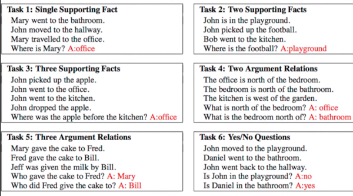

<h1 align="center" style="font-size:80px">
    Question Answering based Applications in NLP
</h1>

There are many question answering based problems in NLP like open domain question answering, reading comprehension, visual question answering, and others. Here I will be exploring a few of the applications.

**Note: Please raise an issue for any suggestions, corrections, and feedback.**

# Textual Question Answering

In this class, we will look into textual based question answering applications.

## Basic Question Answering with Dynamic Memory Networks.ipynb

Dynamic Memory Network (DMN) is a neural network architecture which processes input sequences and questions, forms episodic memories, and generates relevant answers.

- **`Input Module`**: The Input Module processes the facts by using a GRU. For each fact the final hidden state represent the encoded fact (which will be used in Episodic Module).

- **`Question Module`**: The Question Module processes the question word by word and outputs a vector using the same GRU.

- **`Episodic Memory Module`**: The Episodic Module receives the fact and question vectors and computes which facts are more relevant to the given question. It will iterate over the facts multiple times (episodes) and udpates the memory in each iteration.

- **`Answer Module`**: By taking the memory and encoded question as inputs, Answer Module generates the answer.

Dataset used is bAbI which has 20 tasks with an amalgamation of inputs, queries and answers. See the following figure for sample.

#### Resources

- [DMN Paper](https://arxiv.org/pdf/1506.07285.pdf)
- [Stanford Lecture on DMN](https://www.youtube.com/watch?v=T3octNTE7Is)
- [bAbI Dataset](https://research.fb.com/downloads/babi/)
- [Code reference](https://github.com/DSKSD/DeepNLP-models-Pytorch)
