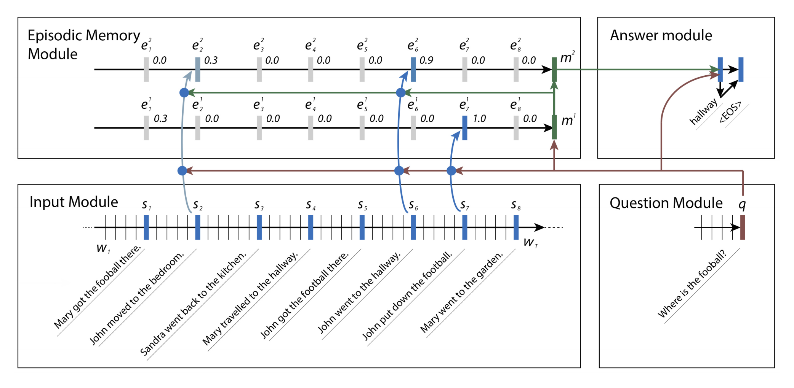
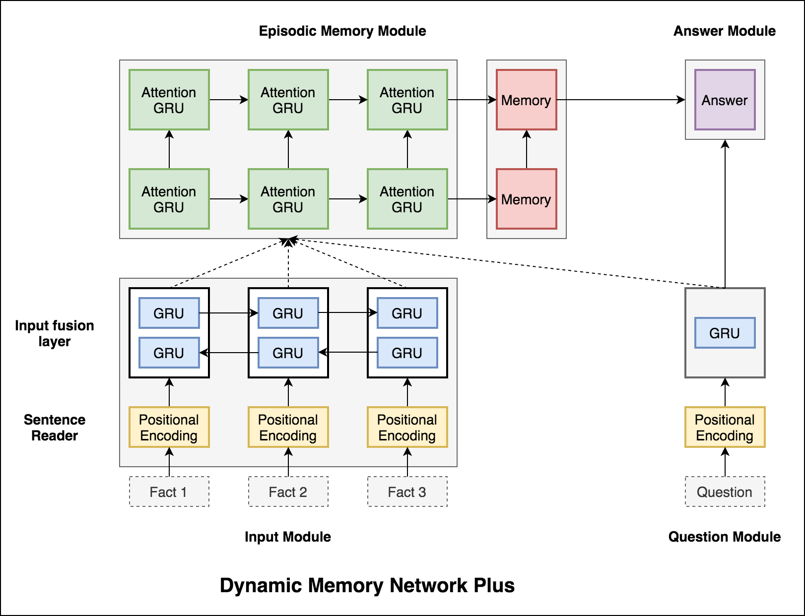
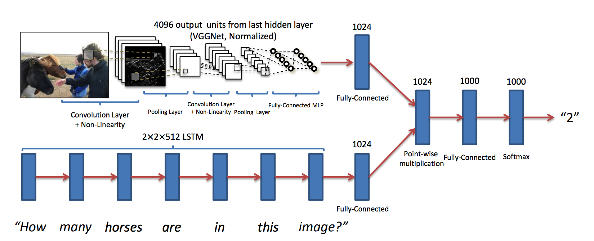
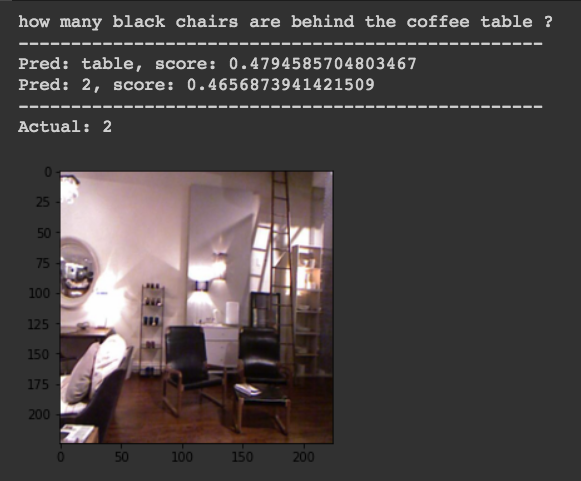
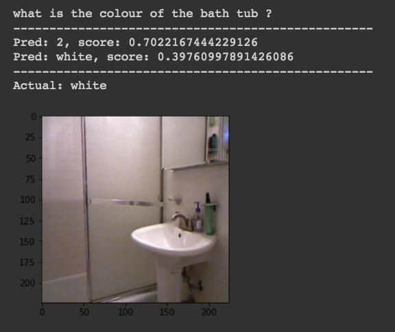
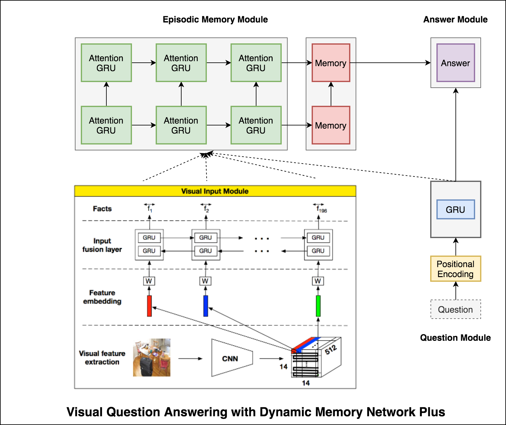

<h1 align="center" style="font-size:80px">
    Question Answering based Applications in NLP
</h1>

There are many question answering based problems in NLP like open domain question answering, reading comprehension, visual question answering, and others. Here I will be exploring a few of the applications.

**Note: Please raise an issue for any suggestions, corrections, and feedback.**

## Basic Question Answering with Dynamic Memory Networks.ipynb

Dynamic Memory Network (DMN) is a neural network architecture which processes input sequences and questions, forms episodic memories, and generates relevant answers.

- **`Input Module`**: The Input Module processes the facts by using a GRU. For each fact the final hidden state represent the encoded fact (which will be used in Episodic Module).

- **`Question Module`**: The Question Module processes the question word by word and outputs a vector using the same GRU.

- **`Episodic Memory Module`**: The Episodic Module receives the fact and question vectors and computes which facts are more relevant to the given question. It will iterate over the facts multiple times (episodes) and udpates the memory in each iteration.

- **`Answer Module`**: By taking the memory and encoded question as inputs, Answer Module generates the answer.

Dataset used is bAbI which has 20 tasks with an amalgamation of inputs, queries and answers. See the following figure for sample.

#### Resources

- [DMN Paper](https://arxiv.org/pdf/1506.07285.pdf)
- [Stanford Lecture on DMN](https://www.youtube.com/watch?v=T3octNTE7Is)
- [bAbI Dataset](https://research.fb.com/downloads/babi/)
- [Code reference](https://github.com/DSKSD/DeepNLP-models-Pytorch)

## Question Answering using DMN Plus.ipynb

To apply the DMN to visual question answering, input module is modified for images. The module splits an image into small local regions and considers each region equivalent to a sentence in the input module for text. The input module for VQA is composed of three parts, illustrated in below fig:
- local region feature extraction
- visual feature embedding
- input fusion layer

**`Input Module Improvement`**: The single GRU in DMN is replaced by two different components.

- `Positional Encoding`: The first component is a sentence reader which encodes the words in a sentence into sentence encoding using a specific encoding scheme called Positional Encoder.
- `Input Fusion Layer`: The main function of this layer is to allow the interaction between different input sentences to exchange information not only in the forward direction but also in the backward direction i.e., information from future states flowing backwards using a Bidirectional GRU module. Basically input fusion layer allows for distant supporting sentences to have a more direct interaction.

**`Memory Module Improvement`**: Attention based GRU is a modification of the original GRU by embedding information from the attention mechanism. In the GRU module, the update gate decides how much of each dimension of the hidden state to retain and how much to update depending upon the input(xi). Since update gate (ui) is calculated using only input(xi) and previous hidden state(hi_1), it certainly lacks any sort of knowledge from the question or the previous memory state. We can use these two to update the hidden state by replacing ui in GRU equation with the gate value(gi_t).

#### References
- [DMN+ Paper](https://arxiv.org/pdf/1603.01417.pdf)
- [Reference Code](https://github.com/dandelin/Dynamic-memory-networks-plus-Pytorch/)

## Basic Visual Question Answering.ipynb

Visual Question Answering (VQA) is the task of given an image and a natural
language question about the image, the task is to provide an accurate natural language answer.

The model uses a two layer LSTM to encode the questions and the last hidden layer of VGGNet to encode the images. The image features are then l_2 normalized. Both the question and image features are transformed to a common space and fused via element-wise multiplication, which is then passed through a fully connected layer followed by a softmax layer to obtain a distribution over answers.

Some sample results:

*Note*:
- The dataset used is very small (6794) instances for training.
- The dataset contains only indoor scenes with, sometimes, lightning conditions that make it difficult to answer the questions. In fact, evaluation on humans shows an accuracy of 50.2%.
- Purpose of the code is to explore VQA not the accuracy.
- [VisualQA](https://visualqa.org/) site contains more comprehensive datasets which are in order of GB's. Since I don't have the compute power, I explored using a small dataset.

#### Resources
- [Visual Question Answering Paper](https://arxiv.org/pdf/1505.00468.pdf)
- [DAQUAR dataset](https://www.mpi-inf.mpg.de/departments/computer-vision-and-machine-learning/research/vision-and-language/visual-turing-challenge/)
- [Introduction to Visual Question Answering & Datasets](https://tryolabs.com/blog/2018/03/01/introduction-to-visual-question-answering/)
- [Visual Question Answering Overview Video](https://www.youtube.com/watch?v=ElZADFTer4I)
- [Reference code](https://github.com/tbmoon/basic_vqa)

## Visual Question Answering with DMN Plus.ipynb

To apply the DMN to visual question answering, input module is modified for images. The module splits an image into small local regions and considers each region equivalent to a sentence in the input module for text.

The input module for VQA is composed of three parts, illustrated in below fig: 
- local region feature extraction
- visual feature embedding
- input fusion layer

- `Local region feature extraction`: To extract features from the image, we use a convolutional neural network based upon the VGG-19 model. We first rescale the input image to 448 × 448 and take the output from the last pooling layer which has dimensionality d = 512 × 14 × 14. The pooling layer divides the image into a grid of 14 × 14, resulting in 196 local regional vectors of d = 512.

- `Visual feature embedding`: As the VQA task involves both image features and text features, we add a linear layer
with tanh activation to project the local regional vectors to the textual feature space used by the question vector q.

- `Input fusion layer`: The main function of this layer is to allow the interaction between different input regions to exchange information not only in the forward direction but also in the backward direction i.e., information from future states flowing backwards using a Bidirectional GRU module. Without global information, their representational power is quite limited, with simple issues like object scaling or locational variance causing accuracy problems.

#### References
- [DMN+ Paper](https://arxiv.org/pdf/1603.01417.pdf)