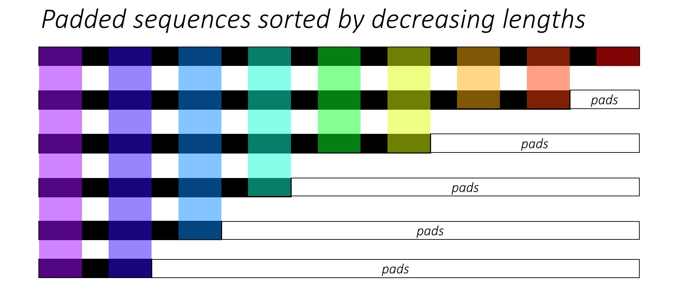

<h1 align="center" style="font-size:80px">
    Architectures & Techniques in NLP
</h1>

**Note: This is not a comprehensive list of architectures used in NLP. There may be even more ways, I am providing the most generally used methods. Please feel free to provide feedback (or) suggesting other ways.**

## RNN.ipynb: Understanding RNN, LSTM, GRU.

Recurrent networks - RNN, LSTM, GRU have proven to be one of the most important unit in NLP applications because of their architecture. There are many problems where the sequence nature needs to be remembered like in order to predict an emotion in the scene, previous scenes needs to be remembered.

My focus here will be on how to use RNN's and variants in PyTorch and also understanding the inputs, outputs of single layer, multi-layer, uni-directional and bi-directional RNN's and it's variants.

Please go through the following resources for better conceptual understanding:
- [Colah blog on LSTMs](https://colah.github.io/posts/2015-08-Understanding-LSTMs/)
- [Edwin Chen blog on exploring LSTMs](http://blog.echen.me/)
- [Illustrated guide to LSTMs and GRUs](https://towardsdatascience.com/illustrated-guide-to-lstms-and-gru-s-a-step-by-step-explanation-44e9eb85bf21)

## pack_padded_sequences.py: Reduce the un-necessary computations in RNN

When training RNN (LSTM or GRU or vanilla-RNN), it is difficult to batch the variable length sequences. For ex: if length of sequences in a size 6 batch is [6, 2, 9, 4, 8, 3], you will pad all the sequences and that will results in 6 sequences of length 9. You would end up doing 54 computation (6x9), but you needed to do only 32 computations. Moreover, if you wanted to do something fancy like using a bidirectional-RNN it would be harder to do batch computations just by padding and you might end up doing more computations than required.

Instead, pytorch allows us to pack the sequence, internally packed sequence is a tuple of two lists. One contains the elements of sequences. Elements are interleaved by time steps and other contains the batch size at each step. This is helpful in recovering the actual sequences as well as telling RNN what is the batch size at each time step. This can be passed to RNN and it will internally optimize the computations.

Resources:
- [Harsh Trivedi gist](https://gist.github.com/HarshTrivedi/f4e7293e941b17d19058f6fb90ab0fec)
- [Stackoverflow post](https://stackoverflow.com/questions/51030782/why-do-we-pack-the-sequences-in-pytorch)
- [Image credits](https://github.com/sgrvinod/)

# Attention Mechanisms

The attention mechanism was born to help memorize long source sentences in neural machine translation (NMT). Rather than building a single context vector out of the encoder's last hidden state, attention is used to focus more on the relevant parts of the input while decoding a sentence. There are various types of attention mechanisms. Here I will point out the most used ones.

## Luong Attention

The context vector will be created by taking encoder outputs and the `current output` of the decoder rnn.

The attention score can be calculated in three ways. `dot`, `general` and `concat`.

Resources:

- [Floyd Hub article on attention mechanisms](https://blog.floydhub.com/attention-mechanism/)
- [Lilian Blog on attention mechanisms](https://lilianweng.github.io/lil-log/2018/06/24/attention-attention.html)
- [Luong Attention Paper](https://arxiv.org/abs/1508.04025)