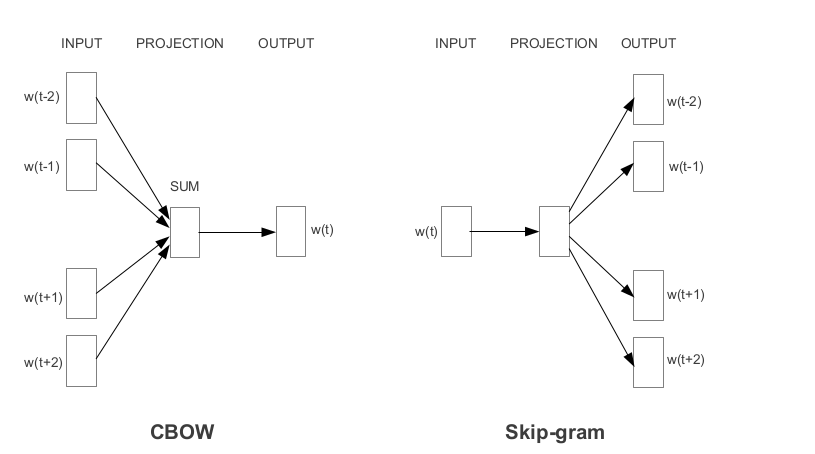
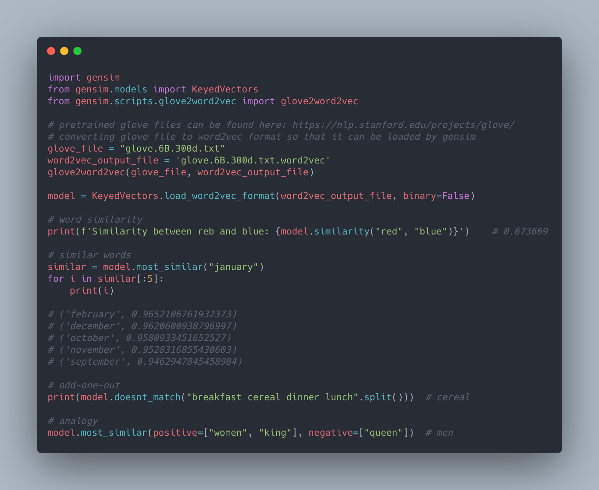
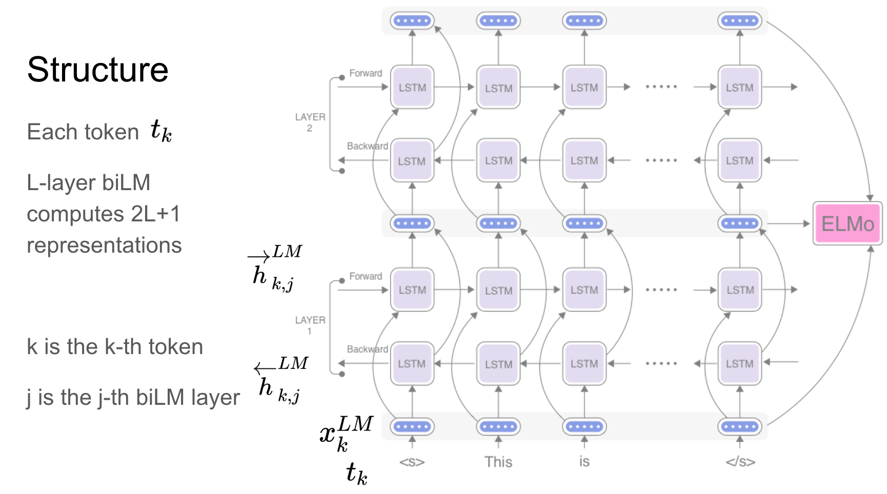

<h1 align="center" style="font-size:80px">
    Word Embeddings
</h1>

**Note: This is not a comprehensive list of embedding methods. There may be even more ways to do the embedding, I am providing the most generally used methods. Please feel free to provide feedback (or) suggesting other ways.**

There are a lot of online material available to explain the concept about Word Embeddings. I can't explain any better than that. So my focus here will be on, how to use the various word embeddings in code. For each concept, I will provide the abstract and relevant resources to look into more details.

### 1. Word2Vec.ipynb: How to use Word2Vec Embeddings.

Word2Vec is one of the most popular pretrained word embeddings developed by Google. Word2Vec is trained on the Google News dataset (about 100 billion words).

The architecture of Word2Vec is really simple. It’s a feed-forward neural network with just one hidden layer. Hence, it is sometimes referred to as a Shallow Neural Network architecture.

Depending on the way the embeddings are learned, Word2Vec is classified into two approaches:

- Continuous Bag-of-Words (CBOW)
- Skip-gram model

Continuous Bag-of-Words (CBOW) model learns the focus word given the neighboring words whereas the Skip-gram model learns the neighboring words given the focus word. 

Resources:

- [Illustrated Word2vec - Jay Alammar](http://jalammar.github.io/illustrated-word2vec/)
- [Intuition & Uses-cases of Embeddings in NLP](https://www.youtube.com/watch?v=4-QoMdSqG_I)
- [Word Embeddings - Sebastian Ruder](https://ruder.io/word-embeddings-1/)
- [Skip Gram Model - Chris McCormick](http://mccormickml.com/2016/04/19/word2vec-tutorial-the-skip-gram-model/)
- [Learning Word Embeddings Andrew NG](https://www.youtube.com/watch?v=xtPXjvwCt64)
- [Word2Vec Andrew NG](https://www.youtube.com/watch?v=jak0sKPoKu8)
- [Stanford NLP Lecture 1](https://www.youtube.com/watch?v=8rXD5-xhemo&list=PLoROMvodv4rOhcuXMZkNm7j3fVwBBY42z&index=1)
- [Word2Vec Paper](https://papers.nips.cc/paper/5021-distributed-representations-of-words-and-phrases-and-their-compositionality.pdf)
- [Google Word2Vec](https://code.google.com/archive/p/word2vec/)

### 2. GloVe Embeddings.ipynb: How to use GloVe (Global Vectors) Embeddings.

GloVe is another commonly used method of obtaining pre-trained embeddings. GloVe aims to achieve two goals:

- Create word vectors that capture meaning in vector space
- Takes advantage of global count statistics instead of only local information

#### Difference between GloVe and Word2Vec

**Global information:** word2vec does not have any explicit global information embedded in it by default. GloVe creates a global co-occurrence matrix by estimating the probability a given word will co-occur with other words. This presence of global information makes GloVe ideally work better. Although in a practical sense, they work almost similar and people have found similar performance with both.

**Presence of Neural Networks:** GloVe does not use neural networks while word2vec does. In GloVe, the loss function is the difference between the product of word embeddings and the log of the probability of co-occurrence. We try to reduce that and use SGD but solve it as we would solve a linear regression. While in the case of word2vec, we either train the word on its context (skip-gram) or train the context on the word (continuous bag of words) using a 1-hidden layer neural network.

Resources:

- [Glove Paper Explaination](https://mlexplained.com/2018/04/29/paper-dissected-glove-global-vectors-for-word-representation-explained/)
- [Colyer blog on GloVe](https://blog.acolyer.org/2016/04/22/glove-global-vectors-for-word-representation/)
- [Code and Pretrained Embeddings](https://nlp.stanford.edu/projects/glove/)
- [Stanford Lecture](https://www.youtube.com/watch?v=ASn7ExxLZws)
- [GloVe Paper](https://www-nlp.stanford.edu/pubs/glove.pdf)

### 3. ELMo.ipynb: How to use ELMo (Embeddings from Language Models) Embeddings.

ELMo is a deep contextualized word representation that models:

- complex characteristics of word use (e.g., syntax and semantics)
- how these uses vary across linguistic contexts (i.e., to model polysemy).

These word vectors are learned functions of the internal states of a deep bidirectional language model (biLM), which is pre-trained on a large text corpus.

**Difference between ELMo and Word2Vec/GloVe Embeddings**

**ELMo Embeddings are context dependent**

For instance, for the same example above “He went to the prison cell with his cell phone to extract blood cell samples from inmates”, both Elmo and BERT would generate different vectors for the three vectors for cell. The first cell (prison cell case) , for instance would be closer to words like incarceration, crime etc. whereas the second “cell” (phone case) would be closer to words like iphone, android, galaxy etc..

**Word2Vec/GloVe Embeddings are not context dependent**

That is the one numeric representation of a word (which we call embedding/vector) regardless of where the words occurs in a sentence and regardless of the different meanings they may have. For instance, after we train word2vec/Glove on a corpus (unsupervised training - no labels needed) we get as output one vector representation for, say the word “cell”. So even if we had a sentence like “He went to the prison cell with his cell phone to extract blood cell samples from inmates”, where the word cell has different meanings based on the sentence context, these models just collapse them all into one vector for “cell” in their output.

Resources:

- [Allennlp](https://allennlp.org/elmo)
- [Analytics Vidhya Post on ELMo](https://www.analyticsvidhya.com/blog/2019/03/learn-to-use-elmo-to-extract-features-from-text/?utm_source=blog&utm_medium=pretrained-word-embeddings-nlp)

- [ELMo talk](https://www.youtube.com/watch?v=9JfGxKkmBc0)

- [NLP with Elmo and Flair](https://www.youtube.com/watch?v=ZEhWpZGlJvE)

- [ELMo Paper](https://arxiv.org/pdf/1802.05365.pdf)